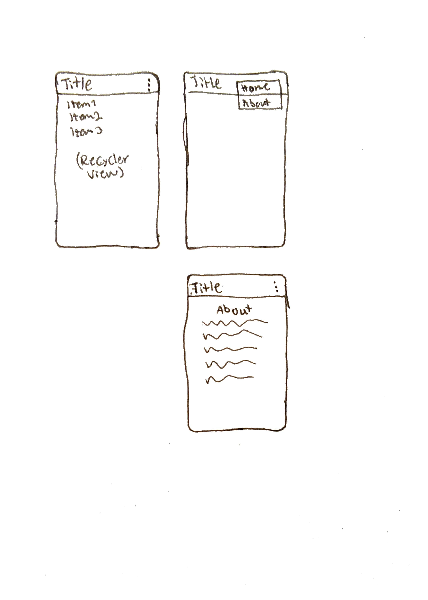

# Rapport

## Skiss

## Webtjänst

Jag gjorde en Json fil som handlar om svampar. Men dessa svampar är då antingen en av de giftigaste
svampar eller svampar som är mindre giftiga men ser roliga ut.
Attributen som jag valde har varit ID och login som var ett måste. Men jag valde också Name, Location
och Category. Attributen Name var då namnet på svampen, Location var svamparnas livsmiljö och var
någonstans man kunde hitta dessa, men det var inga platser på vilket land som man kunde hitta dessa 
svampar. Och den sista car Category som var en kategori på hur giftiga dessa svampar var, antingen
var svamparna gift halten "High", "Medium" och "Low".

https://mobprog.webug.se/json-api?login=a22ricni 
Länk för Json filen.